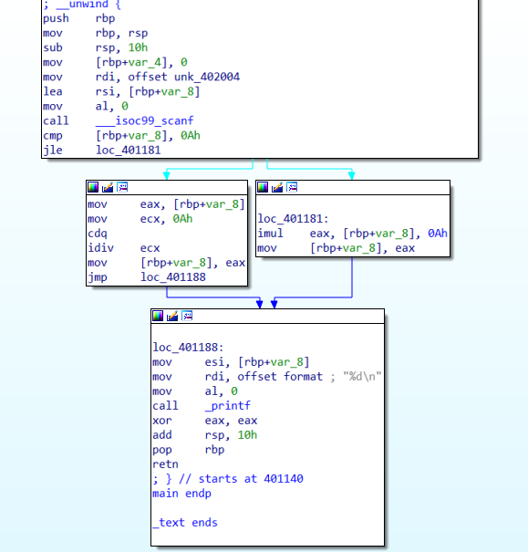
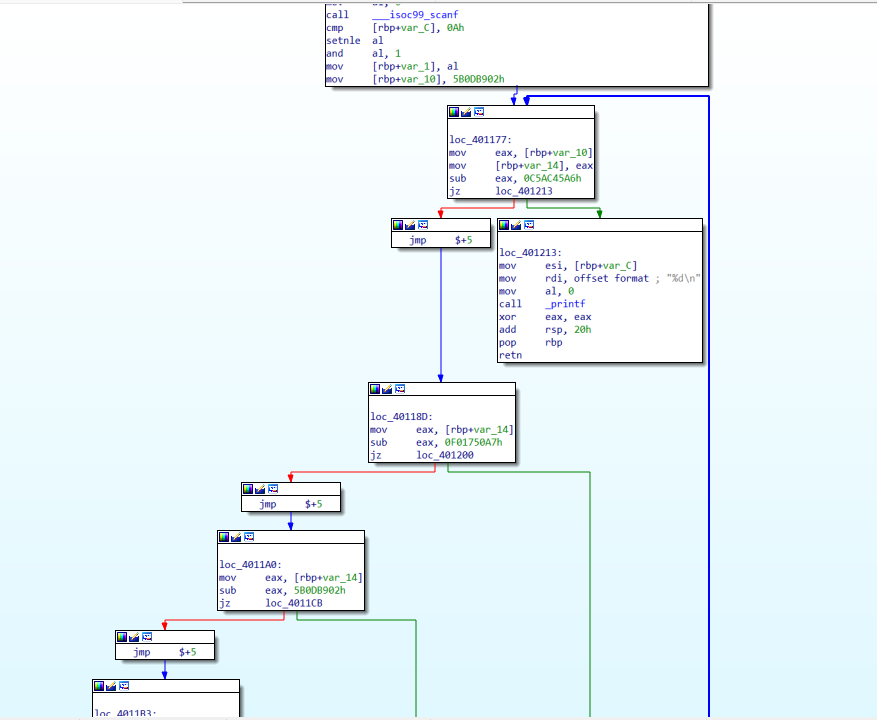
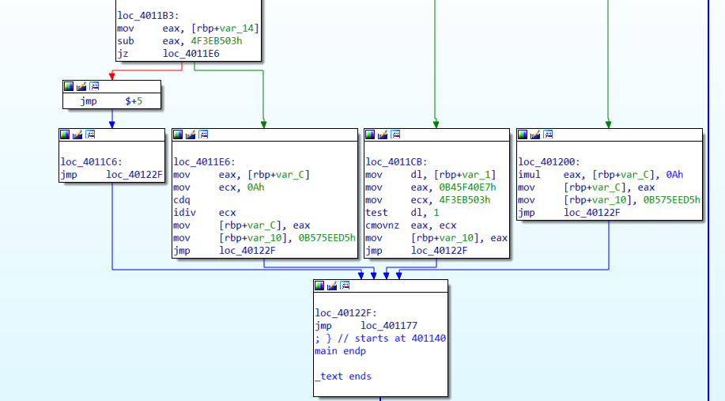
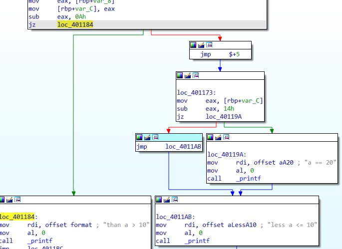
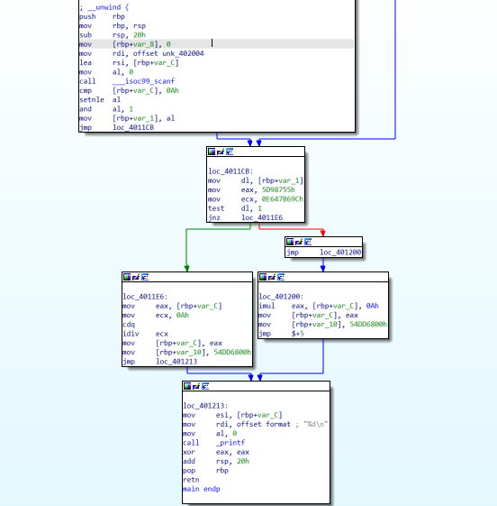
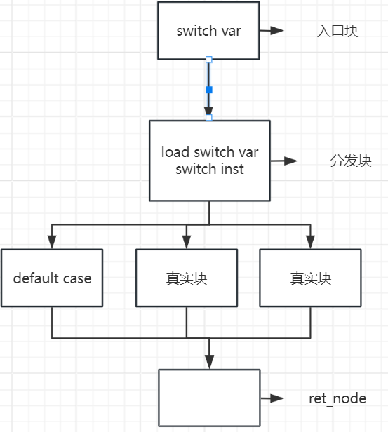
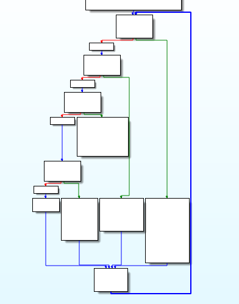
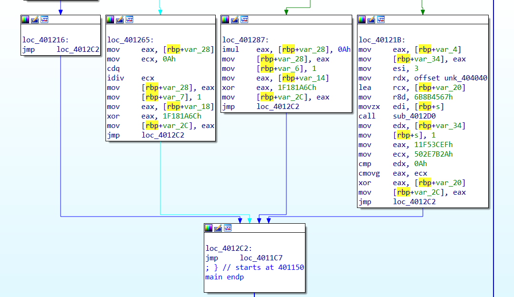
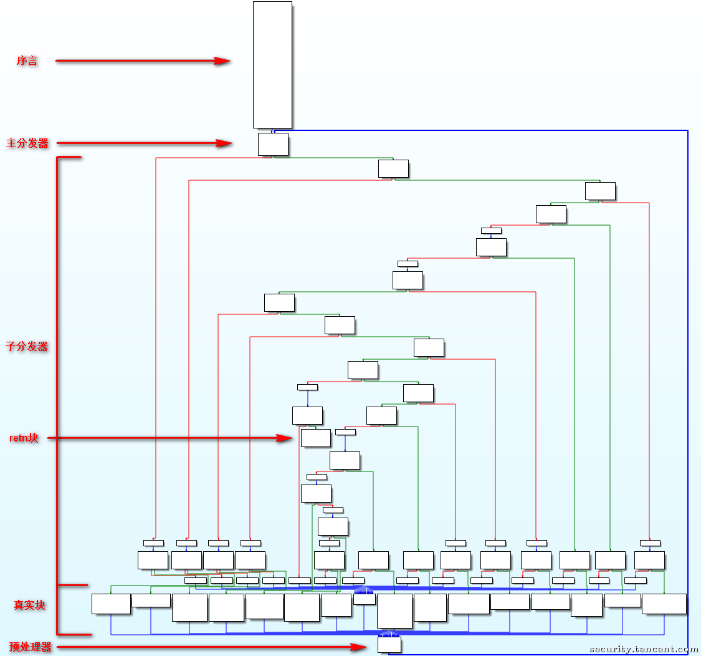
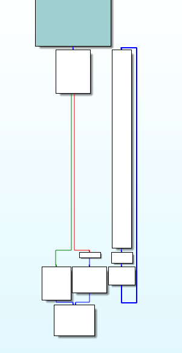

---

title: 基于llvm的开源混淆库学习

published: true（如果改为false，则文章不会在网站上显示）

---


库：https://github.com/bluesadi/Pluto-Obfuscator

# 安装

The first step is always to clone this repository:

```
$ git clone https://github.com/bluesadi/Pluto-Obfuscator.git
$ cd Pluto-Obfuscator
```

No matter which OS you are using, make sure you include all the following commands in the PATH environment variable:

```
gcc g++ cmake ninja
```

If you are using Ubuntu, you may install all the required packages by:

```
$ sudo apt install gcc g++ cmake ninja-build
```

The final step is to execute `./build.sh`, which is a shell script that automatically compiles this project and install it in the [/install](https://github.com/bluesadi/Pluto-Obfuscator/blob/main/install) directory.


需要注意的是：这个库内部实际上是包含了整个llvm的源码的，所以在编译时，不仅仅编译了用于混淆的pass，还编译了llvm的源码，这也是一种编译pass的方式，即在llvm的源码的对应目录下创建代码，然后进行编译。

他这种编译出来的内容，就成了llvm内置的pass了，可以直接使用。

随后的使用：

Now all compiled binaries reside in `/install/bin` directory including `clang` and `clang++` with obfuscation functionalities. You can enable specific obfuscation algorithms by commands in the following format:

```
$ ./install/bin/clang[++] [-mllvm -<identifier/options>] [...] <source files> [-o <output file>]
```

Passed Parameters:

- Flattening: `fla`
- FlatteningEnhanced: `fla-ex`
- Substitution: `sub`
- GlobalsEncryption: `gle`
- MBAObfuscation: `mba mba-prob=100`
- FullProtection: `mba mba-prob=50 fla-ex gle`

# 实际测试

我们的源码：

```c
// main.c
#include <stdio.h>

int main()
{
    int a;
    scanf("%d", &a);
    if (a > 10)
    {
        a /= 10;
    }
    else
    {
        a *= 10;
    }
    printf("%d\n", a);
    return 0;
}
```

编译：

````c
./install/bin/clang  main.c -o main
````

混淆之前的一个cfg图：



混淆前的一个llvm ir代码：

````c
; ModuleID = 'main.c'
source_filename = "main.c"
target datalayout = "e-m:e-p270:32:32-p271:32:32-p272:64:64-i64:64-f80:128-n8:16:32:64-S128"
target triple = "x86_64-unknown-linux-gnu"

@.str = private unnamed_addr constant [3 x i8] c"%d\00", align 1
@.str.1 = private unnamed_addr constant [4 x i8] c"%d\0A\00", align 1

; Function Attrs: noinline nounwind optnone uwtable
define dso_local i32 @main() #0 {
  %1 = alloca i32, align 4
  %2 = alloca i32, align 4
  store i32 0, i32* %1, align 4
  %3 = call i32 (i8*, ...) @__isoc99_scanf(i8* getelementptr inbounds ([3 x i8], [3 x i8]* @.str, i64 0, i64 0), i32* %2)
  %4 = load i32, i32* %2, align 4
  %5 = icmp sgt i32 %4, 10
  br i1 %5, label %6, label %9

6:                                                ; preds = %0
  %7 = load i32, i32* %2, align 4
  %8 = sdiv i32 %7, 10
  store i32 %8, i32* %2, align 4
  br label %12

9:                                                ; preds = %0
  %10 = load i32, i32* %2, align 4
  %11 = mul nsw i32 %10, 10
  store i32 %11, i32* %2, align 4
  br label %12

12:                                               ; preds = %9, %6
  %13 = load i32, i32* %2, align 4
  %14 = call i32 (i8*, ...) @printf(i8* getelementptr inbounds ([4 x i8], [4 x i8]* @.str.1, i64 0, i64 0), i32 %13)
  ret i32 0
}

declare dso_local i32 @__isoc99_scanf(i8*, ...) #1

declare dso_local i32 @printf(i8*, ...) #1

attributes #0 = { noinline nounwind optnone uwtable "disable-tail-calls"="false" "frame-pointer"="all" "less-precise-fpmad"="false" "min-legal-vector-width"="0" "no-infs-fp-math"="false" "no-jump-tables"="false" "no-nans-fp-math"="false" "no-signed-zeros-fp-math"="false" "no-trapping-math"="true" "stack-protector-buffer-size"="8" "target-cpu"="x86-64" "target-features"="+cx8,+fxsr,+mmx,+sse,+sse2,+x87" "tune-cpu"="generic" "unsafe-fp-math"="false" "use-soft-float"="false" }
attributes #1 = { "disable-tail-calls"="false" "frame-pointer"="all" "less-precise-fpmad"="false" "no-infs-fp-math"="false" "no-nans-fp-math"="false" "no-signed-zeros-fp-math"="false" "no-trapping-math"="true" "stack-protector-buffer-size"="8" "target-cpu"="x86-64" "target-features"="+cx8,+fxsr,+mmx,+sse,+sse2,+x87" "tune-cpu"="generic" "unsafe-fp-math"="false" "use-soft-float"="false" }

!llvm.module.flags = !{!0}
!llvm.ident = !{!1}

!0 = !{i32 1, !"wchar_size", i32 4}
!1 = !{!"clang version 12.0.1 (https://github.com/bluesadi/Pluto-Obfuscator.git d454661737a688554e31d0711d5863e41ae894ae)"}
````

反编译的源码：

```c
int __cdecl main(int argc, const char **argv, const char **envp)
{
  int v4[2]; // [rsp+8h] [rbp-8h] BYREF

  v4[1] = 0;
  __isoc99_scanf(&unk_402004, v4, envp);
  if ( v4[0] <= 10 )
    v4[0] *= 10;
  else
    v4[0] /= 10;
  printf("%d\n", (unsigned int)v4[0]);
  return 0;
}
```

基本跟原始代码差别不大。

### fla测试

混淆：

```c
./install/bin/clang -mllvm -fla main.c -o main
```

混淆后的cfg：






混淆后的llvm ir代码：

````c
; ModuleID = 'main.c'
source_filename = "main.c"
target datalayout = "e-m:e-p270:32:32-p271:32:32-p272:64:64-i64:64-f80:128-n8:16:32:64-S128"
target triple = "x86_64-unknown-linux-gnu"

@.str = private unnamed_addr constant [3 x i8] c"%d\00", align 1
@.str.1 = private unnamed_addr constant [4 x i8] c"%d\0A\00", align 1

; Function Attrs: noinline nounwind optnone uwtable
define dso_local i32 @main() #0 {
  %1 = alloca i1, align 1
  %2 = alloca i32, align 4
  %3 = alloca i32, align 4
  store i32 0, i32* %2, align 4
  %4 = call i32 (i8*, ...) @__isoc99_scanf(i8* getelementptr inbounds ([3 x i8], [3 x i8]* @.str, i64 0, i64 0), i32* %3)
  %5 = load i32, i32* %3, align 4
  %6 = icmp sgt i32 %5, 10
  store i1 %6, i1* %1, align 1
  %7 = alloca i32, align 4
  store i32 720303466, i32* %7, align 4
  br label %8

8:                                                ; preds = %0, %23
  %9 = load i32, i32* %7, align 4
  switch i32 %9, label %10 [
    i32 720303466, label %11
    i32 911614489, label %14
    i32 -1353003990, label %17
    i32 1420221888, label %20
  ]

10:                                               ; preds = %8
  br label %23

11:                                               ; preds = %8
  %12 = load volatile i1, i1* %1, align 1
  %13 = select i1 %12, i32 911614489, i32 -1353003990
  store i32 %13, i32* %7, align 4
  br label %23

14:                                               ; preds = %8
  %15 = load i32, i32* %3, align 4
  %16 = sdiv i32 %15, 10
  store i32 %16, i32* %3, align 4
  store i32 1420221888, i32* %7, align 4
  br label %23

17:                                               ; preds = %8
  %18 = load i32, i32* %3, align 4
  %19 = mul nsw i32 %18, 10
  store i32 %19, i32* %3, align 4
  store i32 1420221888, i32* %7, align 4
  br label %23

20:                                               ; preds = %8
  %21 = load i32, i32* %3, align 4
  %22 = call i32 (i8*, ...) @printf(i8* getelementptr inbounds ([4 x i8], [4 x i8]* @.str.1, i64 0, i64 0), i32 %21)
  ret i32 0

23:                                               ; preds = %17, %14, %11, %10
  br label %8
}

declare dso_local i32 @__isoc99_scanf(i8*, ...) #1

declare dso_local i32 @printf(i8*, ...) #1

attributes #0 = { noinline nounwind optnone uwtable "disable-tail-calls"="false" "frame-pointer"="all" "less-precise-fpmad"="false" "min-legal-vector-width"="0" "no-infs-fp-math"="false" "no-jump-tables"="false" "no-nans-fp-math"="false" "no-signed-zeros-fp-math"="false" "no-trapping-math"="true" "stack-protector-buffer-size"="8" "target-cpu"="x86-64" "target-features"="+cx8,+fxsr,+mmx,+sse,+sse2,+x87" "tune-cpu"="generic" "unsafe-fp-math"="false" "use-soft-float"="false" }
attributes #1 = { "disable-tail-calls"="false" "frame-pointer"="all" "less-precise-fpmad"="false" "no-infs-fp-math"="false" "no-nans-fp-math"="false" "no-signed-zeros-fp-math"="false" "no-trapping-math"="true" "stack-protector-buffer-size"="8" "target-cpu"="x86-64" "target-features"="+cx8,+fxsr,+mmx,+sse,+sse2,+x87" "tune-cpu"="generic" "unsafe-fp-math"="false" "use-soft-float"="false" }

!llvm.module.flags = !{!0}
!llvm.ident = !{!1}

!0 = !{i32 1, !"wchar_size", i32 4}
!1 = !{!"clang version 12.0.1 (https://github.com/bluesadi/Pluto-Obfuscator.git d454661737a688554e31d0711d5863e41ae894ae)"}
````

可以看到，就已经复杂了很多了。对应的反编译源码：

````c
int __cdecl main(int argc, const char **argv, const char **envp)
{
  int v3; // eax
  int v5; // [rsp+10h] [rbp-10h]
  int v6[2]; // [rsp+14h] [rbp-Ch] BYREF
  bool v7; // [rsp+1Fh] [rbp-1h]

  v6[1] = 0;
  __isoc99_scanf(&unk_402004, v6, envp);
  v7 = v6[0] > 10;
  v5 = 1527625986;
  while ( v5 != -978565722 )
  {
    if ( v5 == -266907481 )
    {
      v6[0] *= 10;
      v5 = -978565722;
    }
    else if ( v5 == 1527625986 )
    {
      v3 = -266907481;
      if ( v7 )
        v3 = 2030534629;
      v5 = v3;
    }
    else
    {
      v6[0] /= 10;
      v5 = -978565722;
    }
  }
  printf("%d\n", (unsigned int)v6[0]);
  return 0;
}
````

可以看到，还是比较复杂的。

其中的jmp $+5这样的指令很奇怪，没有任何意义，一开始以为是混淆代码加得，后面使用clang编译一个包含switch的代码发现，直接用clang编译出的源代码也会出现这种情况，可能是llvm编译器的问题。如下`(这是正常代码的编译结果，不是混淆后的代码)`：




### deflat测试

使用`https://github.com/cq674350529/deflat`来测试一下去平坦化的效果，这个库的脚本存在一定的问题，即对return 代码块的识别是错误的，其原始的代码如下：

````python
if supergraph.out_degree(node) == 0 and len(node.out_branches) == 0:
    retn_node = node
````

其中的`node.out_branches`代表这个节点的出去的分支，注意不是出度。例如如果在return节点中调用了printf函数，那么就算一个出去的分支。我们修改一下，去掉`and len(node.out_branches) == 0`这个条件。

去平坦化之后的代码如下：



可以看到，跟原始的代码逻辑是有区别的，但是已经非常接近了。


### fla混淆对应的源码

其源码位于：llvm/lib/Transforms/Obfuscation/Flattening.cpp

```c
#include "llvm/Transforms/Obfuscation/Flattening.h"
#include "llvm/IR/Instructions.h"
#include "llvm/InitializePasses.h"
#include "llvm/Support/CommandLine.h"
#include "llvm/Support/raw_ostream.h"
#include "llvm/Transforms/Obfuscation/CryptoUtils.h"
#include "llvm/Transforms/Obfuscation/Utils.h"
#include "llvm/Transforms/Scalar.h"
#include "llvm/Transforms/Utils.h"
#include "llvm/Transforms/Utils/Local.h"
#include <vector>

using namespace llvm;
using std::vector;

// 实现Flattening的runOnFunction方法
// 这个方法是调用该pass进行优化时会调用的方法。
bool Flattening::runOnFunction(Function &F) {
    if (enable) {
        INIT_CONTEXT(F);
        SKIP_IF_SHOULD(F);
        flatten(F);
        return true;
    }
    return false;
}

void Flattening::flatten(Function &F) {
    // 基本块数量不超过1则无需平坦化
    if (F.size() <= 1) {
        return;
    }
    // 覆盖 getAnalysisUsage 函数后，无需再手动调用 LowerSwitchPass
    // FunctionPass *pass = createLowerSwitchPass();
    // pass->runOnFunction(F);
    
    // 将除入口块（第一个基本块）以外的基本块保存到一个 vector
    // 容器中，便于后续处理 首先保存所有基本块
    vector<BasicBlock *> origBB;
    for (BasicBlock &BB : F) {
        origBB.push_back(&BB);
    }
    // 从vector中去除第一个基本块
    origBB.erase(origBB.begin());
    // 获取函数的入口基本块（通常是第一个基本块）
    BasicBlock &entryBB = F.getEntryBlock();
    // 如果第一个基本块的末尾是条件跳转，单独分离
    // BranchInst代表条件或者无条件分支指令
    if (BranchInst *br = dyn_cast<BranchInst>(entryBB.getTerminator())) { // 获取基本块的终结指令(Terminator Instruction)。在LLVM中,每个基本块以一条终结指令结束,终结指令决定了从该基本块退出后会跳转到哪个基本块执行。
        if (br->isConditional()) {	// 常见的终结指令有:ret: 返回指令，ret: 返回指令，cond br: 条件跳转指令
            // 检查入口基本块的终结指令是否是条件跳转指令。如果是条件跳转，就分割入口基本块，创建一个新的基本块，并将其插入到 origBB 向量的开头。	 // 将entryBB的基本块在br处分割,分割出来的新块命名为newBB,返回新块的指针赋值给newBB。
            BasicBlock *newBB = entryBB.splitBasicBlock(br, "newBB");
            origBB.insert(origBB.begin(), newBB);	// 插入到oriBB的开始位置
        }
    }
	
    // 创建两个新的基本块，分别命名为dispatchBB和returnBB，并在入口块的末尾插入一条无条件分支指向dispatchBB
    // &entryBB是一个基本块的引用，它指定了新创建的基本块的插入位置。在这里，新的基本块将被插入到entryBB基本块之前，即作为新的入口块。
    BasicBlock *dispatchBB =
        BasicBlock::Create(*CONTEXT, "dispatchBB", &F, &entryBB);
    BasicBlock *returnBB = BasicBlock::Create(*CONTEXT, "returnBB", &F, &entryBB);
    // 创建分支指令，returnBB跳转到dispatchBB
    BranchInst::Create(dispatchBB, returnBB);
    // 将entry移动到dispatchBB之前，entryBB -> dispatchBB -> returnBB -> other BB
    entryBB.moveBefore(dispatchBB);
    // 去除第一个基本块末尾的跳转
    entryBB.getTerminator()->eraseFromParent();
    // 使第一个基本块跳转到dispatchBB，在第一个基本块的后面创建一个跳转指令，跳向dispatchBB，返回对应的跳转指令
    BranchInst *brDispatchBB = BranchInst::Create(dispatchBB, &entryBB);
    // 到这里，三个块之间的先后关系为entryBB -> dispatchBB，returnBB -> dispatchBB，dispatchBB和returnBB之间还没有直接连接
	
    
    // 初始化Switch变量
    // 在入口块插入alloca和store指令创建并初始化switch变量，初始值为随机值
    uint32_t randNumCase = cryptoutils->get_uint32_t();
    // 在brDispatchBB指令前面分配一个32位整型的内存空间swVarPtr
    AllocaInst *swVarPtr = new AllocaInst(TYPE_I32, 0, "swVar.ptr", brDispatchBB);
    // 在brDispatchBB指令前将一个32位整型立即数randNumCase存储到swVarPtr这个内存地址中
    new StoreInst(CONST_I32(randNumCase), swVarPtr, brDispatchBB);
    
    // 在分发块插入load指令读取switch变量，变量名为swVar
    LoadInst *swVar =
        new LoadInst(TYPE_I32, swVarPtr, "swVar", false, dispatchBB);
    
    // 在分发块插入switch指令实现基本块的调度
    // 创建一个swDefault的基本块,作为switch的默认分支。
    BasicBlock *swDefault =
        BasicBlock::Create(*CONTEXT, "swDefault", &F, returnBB);
    // swDefault的基本块，无条件跳转到returnBB，也就是单独的一个jmp
    BranchInst::Create(returnBB, swDefault);
    // 在分发块的末尾创建一个switch语句swInst,操作数是swVar, 默认分支是swDefault，对应case为0,插入到dispatchBB基本块。
    SwitchInst *swInst = SwitchInst::Create(swVar, swDefault, 0, dispatchBB);
    
    // 将原基本块插入到返回块之前，并在switch中分配case值
    for (BasicBlock *BB : origBB) {
        BB->moveBefore(returnBB);
        swInst->addCase(CONST_I32(randNumCase), BB);
        randNumCase = cryptoutils->get_uint32_t();
    }

    // 在每个基本块最后添加修改switch变量的指令和跳转到返回块的指令
    for (BasicBlock *BB : origBB) {
        // retn BB，没有后继，不需要修改switch指令
        if (BB->getTerminator()->getNumSuccessors() == 0) {
            continue;
        }
        // 有一个后继，删除原本的无条件跳转，根据后继的代码块来修改switch的值
        else if (BB->getTerminator()->getNumSuccessors() == 1) {
            BasicBlock *sucBB = BB->getTerminator()->getSuccessor(0);
            // 删除当前真实块的跳转指令
            BB->getTerminator()->eraseFromParent();
            // 对switch变量进行修改
            ConstantInt *numCase = swInst->findCaseDest(sucBB);
            new StoreInst(numCase, swVarPtr, BB);
            // 跳转到return指令
            BranchInst::Create(returnBB, BB);
        }
        // 有两个后继，条件跳转
        else if (BB->getTerminator()->getNumSuccessors() == 2) {
            ConstantInt *numCaseTrue =
                swInst->findCaseDest(BB->getTerminator()->getSuccessor(0));
            ConstantInt *numCaseFalse =
                swInst->findCaseDest(BB->getTerminator()->getSuccessor(1));
            // 获取跳转指令，
            BranchInst *br = cast<BranchInst>(BB->getTerminator());
            // %result = select <ty> <cond>, <ty> <if_true>, <ty> <if_false>
            SelectInst *sel =
                SelectInst::Create(br->getCondition(), numCaseTrue, numCaseFalse, "",
                                    BB->getTerminator());	// 创建一个SelectInst,根据分支指令的条件判断选择numCaseTrue或numCaseFalse,并插入当前Basic Block末尾。
            // 获取当前Basic Block的终结指令(Terminator Instruction)，也就是跳转指令，并将其删除
            BB->getTerminator()->eraseFromParent();
            // 蒋selectInst指令的结果保存在swVarPtr中
            new StoreInst(sel, swVarPtr, BB);
            // 创建一个无条件跳转指令
            BranchInst::Create(returnBB, BB);
        }
    }
    // 调整和修复栈帧，因为有新的变量，所以需要这个
    fixStack(F);
}

FunctionPass *llvm::createFlatteningPass(bool enable) {
    return new Flattening(enable);
}

char Flattening::ID = 0;
```

整体的思想总结：

1. 将入口代码块的branch语句拆分为了一个单独的代码块，拆分出来的块被作为真实块放入origBB中了，后面对origBB遍历连接后继的时候就会处理。

   在我们上面的实例代码中，入口代码块的branch指令应该是jle指令，即后续会有两个分支，对应到有两个后继的处理方法。

2. 创建分发块和return块。

   ```c
   // 创建分发块，插入位置，新建的BasicBlock会插入到entryBB这个参数基本块的前面
   // 如果之前是这样：entryBB -> other BB，调用BasicBlock::Create后: dispatchBB -> entryBB -> other BB
   BasicBlock *dispatchBB =
       BasicBlock::Create(*CONTEXT, "dispatchBB", &F, &entryBB);
   // 创建返回块，插入位置，新建的BasicBlock会插入到entryBB这个参数基本块的前面
   // dispatchBB -> entryBB -> other BB，调用BasicBlock::Create后: dispatchBB -> returnBB -> entryBB -> other BB
   BasicBlock *returnBB = BasicBlock::Create(*CONTEXT, "returnBB", &F, &entryBB);
   ```

   需要注意的是：`BasicBlock::Create`在某个代码块之前创建一个代码块，这种之前只是顺序上的，并没有在两个基本块直接建立跳转关系。要想连接几个基本块，需要：` BranchInst::Create`来进行连接。

3. 创建好分发块之后，调整各个块之间的先后关系，entryBB -> dispatchBB，returnBB -> dispatchBB，分发块和returnBB之间还没有直接连接。

4. 在分发块前面创建一个switch的变量：

   ````c
   // 初始化Switch变量
   // 在入口块插入alloca和store指令创建并初始化switch变量，初始值为随机值
   uint32_t randNumCase = cryptoutils->get_uint32_t();
   // 在brDispatchBB指令前面分配一个32位整型的内存空间swVarPtr
   AllocaInst *swVarPtr = new AllocaInst(TYPE_I32, 0, "swVar.ptr", brDispatchBB);
   // 在brDispatchBB指令前将一个32位整型立即数randNumCase存储到swVarPtr这个内存地址中
   new StoreInst(CONST_I32(randNumCase), swVarPtr, brDispatchBB);
   ````

   对应到生成的代码如下：

   ```assembly
   setnle  al
   and     al, 1
   mov     [rbp+var_1], al
   mov     [rbp+var_10], 73A2053Ch
   ```

5. 在分发块插入load和switch指令：

   ```c
   LoadInst *swVar = new LoadInst(TYPE_I32, swVarPtr, "swVar", false, dispatchBB);
   // 创建一个代码块，在后面用作switch的默认代码块
   BasicBlock *swDefault = BasicBlock::Create(*CONTEXT, "swDefault", &F, returnBB);
   // 代码块内部的指令为无条件跳转指令，跳转到returnBB
   BranchInst::Create(returnBB, swDefault);
   // 在分发块的末尾创建一个switch语句swInst,操作数是swVar, 默认分支是swDefault，对应case为0,插入到dispatchBB基本块。
   SwitchInst *swInst = SwitchInst::Create(swVar, swDefault, 0, dispatchBB);
   ```

   在`dispatchBB`中插入load指令用于读取之前存储的随机数，并创建一个switch指令，用于基于该随机数的值进行基本块的调度。

6. 将原基本块插入到返回块之前，并分配case值：

   ```c
   for (BasicBlock *BB : origBB) {
       BB->moveBefore(returnBB);
       swInst->addCase(CONST_I32(randNumCase), BB);
       randNumCase = cryptoutils->get_uint32_t();
   }
   ```

   将保存在`origBB`中的所有基本块插入到`returnBB`之前，并为每个基本块分配一个case值。

7. 在每个基本块最后添加修改switch变量的指令和跳转到返回块的指令：

   ```c
   for (BasicBlock *BB : origBB) {
       if (BB->getTerminator()->getNumSuccessors() == 0) {
           continue;
       } else if (BB->getTerminator()->getNumSuccessors() == 1) {
           // 处理非条件跳转
       } else if (BB->getTerminator()->getNumSuccessors() == 2) {
           // 处理条件跳转
       }
   }
   ```

   针对每个基本块的终结指令，根据其类型进行不同的处理。处理非条件跳转和条件跳转的逻辑分别在后面的代码中给出。

##### CFG图

根据这个逻辑，生成的CFG图如下：




##### fixStack解析

对应的源码：

````c
void llvm::fixStack(Function &F) {
    // 定义了两个向量origPHI和origReg,用于保存找到的PHI节点和普通指令。
    vector<PHINode*> origPHI;
    vector<Instruction*> origReg;
    do{
        origPHI.clear();
        origReg.clear();
        BasicBlock &entryBB = F.getEntryBlock();
        for(BasicBlock &BB : F){
            for(Instruction &I : BB){
                if(PHINode *PN = dyn_cast<PHINode>(&I)){
                    origPHI.push_back(PN);
                // 不是入口块alloca并在BB外使用过的,保存  
                }else if(!(isa<AllocaInst>(&I) && I.getParent() == &entryBB)
                    && I.isUsedOutsideOfBlock(&BB)){		// I.isUsedOutsideOfBlock(&BB)这个语句的作用是判断指令I是否在当前基本块BB之外还被使用过。
                    origReg.push_back(&I);
                }
            }
        }
        // DemotePHIToStack就是把PHI降级到栈中，reg就是寄存器，下面就是把寄存器降级到栈中，这样就改成了内存读取
        // 把所有普通指令寄存器降级到栈上
        for(PHINode *PN : origPHI){
            DemotePHIToStack(PN, entryBB.getTerminator());
        }
        for(Instruction *I : origReg){
            DemoteRegToStack(*I, entryBB.getTerminator());
        }
    }while(!origPHI.empty() || !origReg.empty());
}
````


从整体上看这个函数处理了两类指令：

- 第一类是PHI指令
- 第二类是逃逸变量

###### PHI指令

PHI指令是一种在编译器中使用的指令，用于在控制流程图中实现条件分支和循环等结构。PHI指令通常在基本块的起始位置出现，用于选择控制流程图中的路径。

在控制流程图中，PHI指令通常用于选择从不同分支中返回的值。例如，如果一个函数中有一个if-else语句，其中每个分支都返回不同的值，那么PHI指令可以用于选择哪个值应该被返回。例如：

```c
if (a > 10){
    y = 20
}else{
    y = 30
}
printf(y)
```

经过llvm的ir表示出来可能是这样：

```c
if (a > 10){
    y1 = 20
}else{
    y2 = 30
}
y3 = phi(y1, y2);
printf(y3)
```

即每个变量只能被赋值一次，那么y3的值到底是什么？就需要phi指令来表示了。

PHI指令通常用于静态单赋值形式（SSA）编译器中，其中每个变量只被赋值一次。在SSA中，PHI指令用于将来自不同分支的变量值合并为一个值，从而保证程序的正确性。

实例：

````assembly
entry:
  %cond = icmp eq i32 %a, 0
  br i1 %cond, label %ifblock, label %elseblock

ifblock:
  %x = add i32 %a, 1
  br label %mergeblock

elseblock:
  %y = sub i32 %a, 1
  br label %mergeblock

mergeblock:
  %result = phi i32 [ %x, %ifblock ], [ %y, %elseblock ]
  ret i32 %result
````

在这个例子中，我们有一个接受整数参数“%a”的函数。 该函数从“entry”块开始，我们在此处使用条件分支（“icmp eq i32 %a, 0”）来确定“%a”是否等于零。 如果是，我们跳转到 ifblock 块，我们将 1 添加到 %a 。 否则，我们跳转到 elseblock 块，在那里我们从 %a 中减去 1。

在 `ifblock` 和 `elseblock` 块之后，我们跳转到 `mergeblock` 块，我们使用 PHI 指令根据所采用的分支选择要返回的值。 在这种情况下，我们合并 `%x`（在 `ifblock` 块中添加到 `%a` 的值）和 `%y`（在 `elseblock` 块中从 `%a` 减去的值）得到 最终结果“%result”。 最后，我们返回 %result 。在运行时，phi 指令根据“在当前 block 之前执行的是哪一个 predecessor(前任) block”来得到相应的值。

在 phi 指令的语法中，后面是一个列表，列表中的每个元素是一个 value/label 对，每个 label 表示一个当前 block 的 predecessor block，phi 指令就是根据 label 选相应的 value。phi 指令必须在 basic block 的最前面，也就是在一个 basic block 中，在 phi 指令之前不允许有非 phi 指令。

PHI指令又是基于前驱块的指令，前驱块被打乱了PHI指令肯定会出现错误，因此我们要对PHI指令进行修复。

对于 PHI Node，fixStack 直接简单的粗暴的调用 `DemotePHIToStack` 将 PHI Node 变量到 栈中分配。Demote是降级的意思，原本PHI节点中的变量通常被映射到目标架构的寄存器中。但DemotePHIToStack会将其转换为栈分配的变量。`DemoteToStack`就是用alloca, store, load三类内存访问指令来代替之前的PHI指令。为什么是Stack呢，因为LLVM IR中的alloca指令是在栈中进行分配的，这点不同于C语言中的`malloc`函数。将所有PHI指令用三类内存访问指令表示，并将所有alloca指令都放在入口块，PHI指令的错误就被修复了。


在实际执行代码中，其实phi是不存在的，目前的传统指令集并没有phi，所以在LLVM Backend中会有SSA destruction，然后就有phi的消除。

而要转为所谓可实际执行的代码，即SSA的转换，一个最重要的就是phi的消除。

那么，对于消除phi，一种是赤裸裸的phi。 如:

```c
bb0:
  a0 = 1
  -> bb1
bb1:
  a1 = phi(a0, a3)
  ...
  -> bb2
bb2:
  a3 = 1
  ...
  -> bb1
```

比如 我要消除bb1的 a1 的phi，那么就是在bb1的前驱节点与后驱节点插入赋值与替换，其规则是对于xi = phi(xj, xk), 沿传入xj的边插入xi = xj, 沿xk的边插入xi = xk。所以对于上文的bb1，我们要替换的话，我们就需要变为：

```c
bb0:
  a0 = 1
  a1 = a0
  ->bb1
bb1:
  ...
  -> bb2
bb2:
  a3 = 1
  ...
  a1 = a3
  -> bb1

// 更加正确的表达应该是
bb0:
  %a0 = add i32 1, 1
  store i32 %a0, i32* %a1_alloca
  br label %bb1

bb1:
  // 从栈中取出
  %a1_load = load i32, i32* %a1_alloca 

bb2:
  %a3 = add i32 1, 1
  store i32 %a3, i32* %a1_alloca
  br label %bb1
```

这样就消除了phi，并且保持了基本不动，这一个就是DemotePHIToStack函数做的事。所以这个函数的作用就是:把一个 PHI 节点计算出的虚拟寄存器(virtual register)替换成栈帧上明确分配的一块内存。


然后让我们把问题变得复杂一点

```c
bb0:
  a0 = 1
  -> bb1
bb1:
  a1 = phi(a0, a3)
  ...
  -> bb2
bb2:
  b2 = 1
  c3 = ...
  d2 = ...
  ...
  -> bb3
bb3:
  a3 = phi(a2, a4)
  ...
  y = a3 + 1
  i = a0 + 1
  (i < 100) -> bb1, bb4
bb4:
  return  
```

这里，我们注意bb1中的phi的a3在bb3，并且bb3末尾有了多个出路，即bb1, bb4. 若我们消除bb1的phi，我们依然可以在它的前驱点bb0做，但是我们不能在前驱驱结点bb3做，因为在bb3的terminator处（对应LLVM的TerminalInst与Terminator）引入代码，则会影响bb3到bb4的执行。所以，为了解决这个问题，我们可以把bb3->bb1的边进行拆分，引入一条新的边，如bb5.

```c
bb0:
  a0 = 1
  a1 = a0
  -> bb1
bb1:
  ...
  -> bb2
bb2:
  b2 = 1
  c3 = ...
  d2 = ...
  ...
  -> bb3
bb3:
  a3 = phi(a2, a4) // keep the same for simplify explain
  ...
  y = a3 + 1
  i = a0 + 1
  (i < 100) -> bb5, bb4
bb4:
  return
bb5:
  a1 = a3
  -> bb1
```

这样就可以解决，而在编译原理中，我们把bb3->bb1的边称为关键边。

参考：

- https://www.zhihu.com/question/49642237


###### 逃逸变量

**逃逸变量**指在一个基本块中定义，并且在另一个基本块被引用的变量。在原程序中某些基本块可能引用之前某个基本块中的变量，平坦化后原基本块之间不存在确定的前后关系了（由分发块决定），因此某些变量的引用可能会损坏。这类逃逸变量在编译（LLVM IR->目标平台机器代码）时会出现分不清定义和引用顺序的问题，因此也需要进行修复。

判断一个指令是否含有逃逸变量的方法如下：

- 如果一条指令位于入口块，并且该指令为 alloca 指令则该指令一定不含逃逸变量。这是因为 alloca 指令用于在函数的栈帧上分配内存，而栈帧是局部于函数的。在函数的入口块中分配的内存不会逃逸到函数外部的作用域，因此这样的指令不会包含逃逸变量。这个条件的目的是排除那些在入口块中分配的局部变量。
- 否则如果该指令在其他基本块中也被使用过则该指令可能含有逃逸变量。因为如果一条指令在其他基本块中被使用，那么它的值可能在函数外部被引用或使用。这意味着该指令的结果可能逃逸到函数外部，因此被使用的指令被认为是含有逃逸变量的。

修复的方法是调用`DemoteRegToStack`这个函数。Reg是什么意思呢，这里的Reg是寄存器Register的缩写，**LLVM IR中所有本地变量都称做“虚拟寄存器”**，所以这里是DemoteRegToStack。

```
isa<AllocaInst>(&I) && I.getParent() == &entryBB
```

这段代码用来判断当前指令是否是alloca指令，并且是否位于函数入口块，该类指令不算是逃逸变量，所以不做处理（因为修复逃逸变量就是靠入口块的alloca指令和store, load指令）。

```
I.isUsedOutsideOfBlock(&BB)
```

这段代码则是判断当前指令是否在除当前基本块以外的基本块被使用，成立则为逃逸变量，需要调用`DemoteRegToStack`函数进行处理。


**总结修复的方法：将 PHI 指令和逃逸变量都转化为内存存取指令。**

### fla-ex测试

这个是增强的控制流平坦化，主要是加入了后继对前驱的执行依赖。参考网址：https://bbs.kanxue.com/thread-274778.htm

混淆：

````c
 ./install/bin/clang -mllvm -fla-ex main.c -o main
````

混淆后的CFG：



我们来注意观察他最后一层的代码：



根据指令，我们大概能知道中间的两个就是原本的真实块。最右侧的代码块就是原来入口代码块拆分出来的的最后一条分支指令代码块，然后根据后继进行指令扩充得到的。

### 去平坦化代码编写

##### 判断真实块、ret块、分发块等

我们使用的识别CFG图的工具生成CFG图的逻辑应该与llvm一致`（不同的工具识别CFG的逻辑并不相同）`，否则在块的识别上有很大差异，那么识别块就会出错，导致还原失败。一种比较经典的识别实例如下`（借用腾讯的）`：



主要思路： 

1. 函数的开始地址为序言的地址
2. 序言的后继为主分发器
3. 后继为主分发器的块为预处理器
4. 后继为预处理器的块为真实块
5. 无后继的块为retn块
6. 剩下的为无用块

##### 模拟执行

模拟的过程就相当于在向下遍历一棵树`（但是因为循环的存在，所以称为有向图更合适。）`，整体的思路为：

1. 设置好unicorn的模拟执行环境
2. 从指定的函数的开始位置向下模拟执行，直到遇到了一个真实块，那么就说明两个真实块之间存在连接，在两个函数之间建立连接。然后从遇到的新的真实块继续向下模拟指向。
3. 如果遇到cmov指令，说明真实块存在分支，那么就向队列中插入一个分支状态，继续模拟另外的分支状态。

注意点：模拟过程中最需要注意的点就是循环。因为存在循环，所以我们需要判断是不是重复访问，否则可能一直在循环里面模拟，导致死循环，如何避免？循环一般分为两种情况，我们将模拟过程中的起始真实块称为当前模拟的块，后续遇到的真实块称为新到来的真实块：

1. 循环指向自己当前的代码块。

   对于这种情况，我们记录访问当前模拟的代码块的起始点的次数即可，如果是第二次访问，说明存在这样一个循环，我们只需要记录好存在这个映射关系即可。**注意：对于指向自己的这种循环情况，不能将遇到的真实块加入队列中进行模拟，因为此前已经从该位置向下模拟了一次了，所有情况都已经模拟了，再次加入队列中模拟会导致死循环。**

2. 循环指向另外的代码块。

   对于这种情况，我们就判断他们之间的映射关系之前是否建立了。如果没有建立，说明是第一次访问，那么就需要从新的真实块往下进行模拟。如果已经建立了，说明新到来的真实块此前已经遇到过，也就是已经模拟过了，就没有必要继续往下模拟了。


这个代码存在一些缺陷：

1. 真实块和nop块的识别并不是很准确，感觉不同的加平坦化方法，真实块和nop块的特征并不相同，不知道怎么去精确的识别和区分他们。

   不过，至少我们使用的识别CFG图的工具生成CFG图的逻辑应该与llvm一致，否则在块的识别上有很大差异，那么真实块和nop块的识别就会差异更大了。

2. 必须要执行的call的地址需要针对每个程序进行修改，因为不同的平坦化程序中，与执行流有关的call的地址可能不同。


````python
import logging
import collections
from capstone.x86 import *
from capstone import *
from unicorn.x86_const import *
from unicorn import *
from collections import defaultdict
import angr
import argparse
import sys

from util import *
import am_graph

# 必须要执行的call的地址，因为有些call与执行流有关，所以必须要执行
call_addrs = ["0x12d0",]
end_addrs = [0x05149, 0x04578]


def get_relevant_nop_nodes(supergraph, pre_dispatcher_node, prologue_node, retn_nodes):
    """
    用于获取真实块和nop块(switch的if判断等代码块)
    这里的识别逻辑存在缺陷，会将应该nop的块识别为真实块，同时也会将真实块识别为nop
    """
    relevant_nodes = []
    nop_nodes = []
    # 遍历图中所有节点，根据节点的情况，将节点划归为真实块和nop块
    for node in supergraph.nodes():
        if supergraph.has_edge(node, pre_dispatcher_node) and node.size > 8:
            # XXX: use node.size is faster than to create a block
            relevant_nodes.append(node)
            continue
        if node.addr in (prologue_node.addr, pre_dispatcher_node.addr) or node.addr in [retn_node.addr for retn_node in retn_nodes]:
            continue
        nop_nodes.append(node)
    return relevant_nodes, nop_nodes


def reg_ctou(regname: str):
    # This function covert capstone reg name to unicorn reg const.
    # https://github.com/unicorn-engine/unicorn/blob/master/bindings/python/unicorn/x86_const.py
    mp = {'INVALID': 0,  'AH': 1,  'AL': 2,  'AX': 3,  'BH': 4,  'BL': 5,  'BP': 6,  'BPL': 7,  'BX': 8,  'CH': 9,  'CL': 10,  'CS': 11,  'CX': 12,  'DH': 13,  'DI': 14,  'DIL': 15,  'DL': 16,  'DS': 17,  'DX': 18,  'EAX': 19,  'EBP': 20,  'EBX': 21,  'ECX': 22,  'EDI': 23,  'EDX': 24,  'EFLAGS': 25,  'EIP': 26,  'ES': 28,  'ESI': 29,  'ESP': 30,  'FPSW': 31,  'FS': 32,  'GS': 33,  'IP': 34,  'RAX': 35,  'RBP': 36,  'RBX': 37,  'RCX': 38,  'RDI': 39,  'RDX': 40,  'RIP': 41,  'RSI': 43,  'RSP': 44,  'SI': 45,  'SIL': 46,  'SP': 47,  'SPL': 48,  'SS': 49,  'CR0': 50,  'CR1': 51,  'CR2': 52,  'CR3': 53,  'CR4': 54,  'CR8': 58,  'DR0': 66,  'DR1': 67,  'DR2': 68,  'DR3': 69,  'DR4': 70,  'DR5': 71,  'DR6': 72,  'DR7': 73,  'FP0': 82,  'FP1': 83,  'FP2': 84,  'FP3': 85,  'FP4': 86,  'FP5': 87,  'FP6': 88,  'FP7': 89,  'K0': 90,  'K1': 91,  'K2': 92,  'K3': 93,  'K4': 94,  'K5': 95,  'K6': 96,  'K7': 97,  'MM0': 98,  'MM1': 99,  'MM2': 100,  'MM3': 101,  'MM4': 102,  'MM5': 103,  'MM6': 104,  'MM7': 105,  'R8': 106,  'R9': 107,  'R10': 108,  'R11': 109,  'R12': 110,  'R13': 111,  'R14': 112,  'R15': 113,  'ST0': 114,  'ST1': 115,  'ST2': 116,  'ST3': 117,  'ST4': 118,  'ST5': 119,  'ST6': 120,  'ST7': 121,  'XMM0': 122,  'XMM1': 123,  'XMM2': 124,  'XMM3': 125,  'XMM4': 126,  'XMM5': 127,  'XMM6': 128,  'XMM7': 129,  'XMM8': 130,  'XMM9': 131,  'XMM10': 132,  'XMM11': 133,  'XMM12': 134,  'XMM13': 135,  'XMM14': 136,  'XMM15': 137,  'XMM16': 138,  'XMM17': 139,  'XMM18': 140,  'XMM19': 141,  'XMM20': 142,  'XMM21': 143,  'XMM22': 144,  'XMM23': 145,  'XMM24': 146,  'XMM25': 147,  'XMM26': 148,
          'XMM27': 149,  'XMM28': 150,  'XMM29': 151,  'XMM30': 152,  'XMM31': 153,  'YMM0': 154,  'YMM1': 155,  'YMM2': 156,  'YMM3': 157,  'YMM4': 158,  'YMM5': 159,  'YMM6': 160,  'YMM7': 161,  'YMM8': 162,  'YMM9': 163,  'YMM10': 164,  'YMM11': 165,  'YMM12': 166,  'YMM13': 167,  'YMM14': 168,  'YMM15': 169,  'YMM16': 170,  'YMM17': 171,  'YMM18': 172,  'YMM19': 173,  'YMM20': 174,  'YMM21': 175,  'YMM22': 176,  'YMM23': 177,  'YMM24': 178,  'YMM25': 179,  'YMM26': 180,  'YMM27': 181,  'YMM28': 182,  'YMM29': 183,  'YMM30': 184,  'YMM31': 185,  'ZMM0': 186,  'ZMM1': 187,  'ZMM2': 188,  'ZMM3': 189,  'ZMM4': 190,  'ZMM5': 191,  'ZMM6': 192,  'ZMM7': 193,  'ZMM8': 194,  'ZMM9': 195,  'ZMM10': 196,  'ZMM11': 197,  'ZMM12': 198,  'ZMM13': 199,  'ZMM14': 200,  'ZMM15': 201,  'ZMM16': 202,  'ZMM17': 203,  'ZMM18': 204,  'ZMM19': 205,  'ZMM20': 206,  'ZMM21': 207,  'ZMM22': 208,  'ZMM23': 209,  'ZMM24': 210,  'ZMM25': 211,  'ZMM26': 212,  'ZMM27': 213,  'ZMM28': 214,  'ZMM29': 215,  'ZMM30': 216,  'ZMM31': 217,  'R8B': 218,  'R9B': 219,  'R10B': 220,  'R11B': 221,  'R12B': 222,  'R13B': 223,  'R14B': 224,  'R15B': 225,  'R8D': 226,  'R9D': 227,  'R10D': 228,  'R11D': 229,  'R12D': 230,  'R13D': 231,  'R14D': 232,  'R15D': 233,  'R8W': 234,  'R9W': 235,  'R10W': 236,  'R11W': 237,  'R12W': 238,  'R13W': 239,  'R14W': 240,  'R15W': 241,  'IDTR': 242,  'GDTR': 243,  'LDTR': 244,  'TR': 245,  'FPCW': 246,  'FPTAG': 247,  'MSR': 248,  'MXCSR': 249,  'FS_BASE': 250,  'GS_BASE': 251,  'FLAGS': 252,  'RFLAGS': 253,  'FIP': 254,  'FCS': 255,  'FDP': 256,  'FDS': 257,  'FOP': 258,  'ENDING': 259, }
    regname = regname.upper()
    return mp[regname]


def get_context():  # record all X86/64 regs
    global mu
    return mu.context_save()


def set_context(context: bytes):
    global mu
    if context == None:
        return
    else:
        mu.context_restore(context)
    return


def alignment(addr):
    return addr & 0xfffffffffffff000


def hook_mem_access(uc, type, address, size, value, userdata):
    """
    每次遇到一个没有映射的地址，进行映射，同时写入正确的数据
    注意：unicorn中的地址映射必须是4kb对齐的。所以，每次是要发送unmmap，就映射4kb
    """
    address = alignment(address)
    content = bin[address-base: address-base+1024*4]
    mu.mem_map(alignment(address), 1024*4)
    mu.mem_write(address, content)
    return True


def get_block_start_addr(addr):
    global relevants
    for node in relevants.values():
        if node.addr <= addr < node.addr + node.size:
            return node.addr
    return None


def hook_code(uc, address, size, user_data):
    # address为hook的地址，size为指令的大小
    global base
    global is_success
    global relevants
    global next_real_block_addr
    global block_start_addr
    global queue
    global flow
    global cur_start_addr
    global patch_instrs
    global execute_count

    # 对当前待执行的代码进行反汇编，实际上只有一条指令，参数为：code，code_offset addr
    for ins in md.disasm(bin[address-base:address - base + size], address-base):
        if address in relevants.keys():
            if flow.get(address) == cur_start_addr:
                uc.emu_stop()
                return
            elif address == cur_start_addr and execute_count == 1:
                # 如果是真是块，记录是不是第一次到这里（因为从真实块开始执行也算是一次）
                execute_count += 1
            else:
                is_success = True
                next_real_block_addr = address
                uc.emu_stop()
                return
        if address - 4194304 in end_addrs:
            is_success = False
            uc.emu_stop()
            return

        if ins.mnemonic.startswith("call"):
            # 对call指令特殊处理，判断是直接跳过还是对call也模拟执行
            flag_pass = True
            for call_addr in call_addrs:
                # 判断当前call是不是必须要执行，因为某些call可能跟执行流有关
                if ins.op_str.lower() == call_addr.lower():
                    flag_pass = False

            if flag_pass:
                uc.reg_write(UC_X86_REG_RIP, address + size)

        # 结束块单独处理，如果是真实块的ret，不应该继续往下执行，而是直接停止
        if ins.id == X86_INS_RET and cur_start_addr in [retn_node.addr for retn_node in retn_nodes]:
            is_success = False
            uc.emu_stop()
            return False

        # ollvm branch
        if ins.mnemonic.startswith('cmov'):
            # 保存cmov指令的地址，后续用于patch
            if ins.address not in [ins.address for ins in patch_instrs[relevants[block_start_addr]]]:
                patch_instrs[relevants[block_start_addr]].append(ins)

            # 得到寄存器对应的编号，即cmove的操作的寄存器编号
            regs = [reg_ctou(x) for x in ins.op_str.split(', ')]
            assert len(regs) == 2

            ctx = get_context()
            # 保存一个不赋值的状态到队列中
            uc.reg_write(UC_X86_REG_RIP, address + size)
            queue.append((address + size, get_context()))
            # 当前执行流继续以赋值的状态执行下去
            set_context(ctx)
            uc.reg_write(regs[0], uc.reg_read(regs[1]))
            # 跳过当前指令。
            uc.reg_write(UC_X86_REG_RIP, address + size)


def find_path(start_addr, branch=None):
    """
    通过unicorn模拟来找到下一个block，branch指定了cmov的分支条件。
    """
    global mu
    global block_start_addr
    global next_real_block_addr
    global is_success
    global cur_start_addr
    global execute_count

    if block_start_addr != start_addr:
        execute_count = 2
    else:
        execute_count = 1

    cur_start_addr = start_addr

    is_success = False
    next_real_block_addr = 0

    # unitl 参数不重要，因为hookcode会在合适的时候结束模拟
    mu.emu_start(start_addr, start_addr+0x10000)
    if is_success:
        return next_real_block_addr
    return None


def fix(bin: bytearray, flow: dict, nop_nodes: list, patch_instrs: dict):
    ori_len = len(bin)
    # patch掉子分发节点
    for nop_node in nop_nodes:
        fill_nop(bin, nop_node.addr-base,
                 nop_node.size, project.arch)
    # remove unnecessary control flows
    # 连接各个真实块
    for parent, childs in flow.items():
        # 遍历所有真实块和其对应的后继的真实块。
        parent = relevants[parent]
        # 只有一个后继，直接jmp即可
        if len(childs) == 1:
            parent_block = project.factory.block(parent.addr, size=parent.size)
            last_instr = parent_block.capstone.insns[-1]
            file_offset = last_instr.address - base
            # patch the last instruction to jmp

            if project.arch.name in ARCH_X86:
                fill_nop(bin, file_offset, last_instr.size, project.arch)
                patch_value = ins_j_jmp_hex_x86(
                    last_instr.address, childs[0], 'jmp')
            patch_instruction(bin, file_offset, patch_value)
        # 有多个后继，说明有cmovxx，将cmovxx修改为jxx
        else:
            instr = patch_instrs[parent]
            file_offset = instr[len(instr)-1].address
            # patch instructions starting from `cmovx` to the end of block
            fill_nop(bin, file_offset, parent.addr +
                     parent.size - base - file_offset, project.arch)

            for index, ins in enumerate(instr):
                file_offset = ins.address
                if project.arch.name in ARCH_X86:
                    # patch the cmovx instruction to jx instruction
                    patch_value = ins_j_jmp_hex_x86(
                        ins.address+base, childs[index], ins.mnemonic[len('cmov'):])
                    patch_instruction(bin, file_offset, patch_value)

                    file_offset += 6
                    # patch the next instruction to jmp instrcution
                    if index == len(instr)-1:
                        patch_value = ins_j_jmp_hex_x86(
                            ins.address+6+base, childs[index+1], 'jmp')
                        patch_instruction(bin, file_offset, patch_value)
    return bin


if __name__ == '__main__':
    md = Cs(CS_ARCH_X86, CS_MODE_64)
    md.detail = True

    parser = argparse.ArgumentParser(description="deflat control flow script")
    parser.add_argument("-f", "--file", help="binary to analyze")
    parser.add_argument(
        "--addr", help="address of target function in hex format")
    args = parser.parse_args()

    if args.file is None or args.addr is None:
        parser.print_help()
        sys.exit(0)

    filename = args.file
    start = int(args.addr, 16)
    with open(filename, 'rb') as fp:
        bin = fp.read()

    project = angr.Project(filename, load_options={'auto_load_libs': False})

    obj = project.loader.main_object
    # do normalize to avoid overlapping blocks, disable force_complete_scan to avoid possible "wrong" blocks
    cfg = project.analyses.CFGFast(normalize=True, force_complete_scan=False)
    target_function = cfg.functions.get(start)
    # A super transition graph is a graph that looks like IDA Pro's CFG
    supergraph = am_graph.to_supergraph(target_function.transition_graph)

    base_addr = project.loader.main_object.mapped_base >> 12 << 12
    # get prologue_node and retn_node
    retn_nodes = []
    prologue_node = None
    # patch_instrs用于保存每个代码块中需要patch的指令
    patch_instrs = collections.defaultdict(list)
    for node in supergraph.nodes():
        # 当前节点入度为0，说明是序言node
        if supergraph.in_degree(node) == 0:
            prologue_node = node
        if supergraph.out_degree(node) == 0:
            retn_nodes.append(node)

    if prologue_node is None or prologue_node.addr != start:
        print("Something must be wrong...")
        sys.exit(-1)

    main_dispatcher_node = list(supergraph.successors(prologue_node))[0]
    for node in supergraph.predecessors(main_dispatcher_node):
        if node.addr != prologue_node.addr:
            pre_dispatcher_node = node
            break

    relevant_nodes, nop_nodes = get_relevant_nop_nodes(
        supergraph, pre_dispatcher_node, prologue_node, retn_nodes)

    # 主分发器节点
    main_dispatcher_node = list(supergraph.successors(prologue_node))[0]
    relevant_block_addrs = [(node.addr) for node in relevant_nodes]
    # 记录了所有真实块，{真实块的地址：对应的node}
    relevants = {}
    for node in list(relevant_nodes) + [prologue_node] + [retn_node for retn_node in retn_nodes]:
        relevants[node.addr] = node

    print('*******************simulated execution*********************')
    flow = collections.defaultdict(list)
    instrs_size = 0
    memset_count = 0

    mu = Uc(UC_ARCH_X86, UC_MODE_64)
    # init stack
    mu.mem_map(0x80000000, 0x10000 * 8)
    # map 4MB memory for this emulation
    base = obj.mapped_base
    mu.mem_map(base, 16 * 1024 * 1024)

    # 段映射
    for seg in obj.segments:
        mu.mem_write(seg.vaddr, bin[seg.offset:seg.offset+seg.filesize])
    mu.reg_write(UC_X86_REG_RSP, 0x80000000 + 0x10000 * 6)

    # 对每条指令hook，关键的hook，用于对执行过程中的代码进行处理
    mu.hook_add(UC_HOOK_CODE, hook_code)
    mu.hook_add(UC_HOOK_MEM_UNMAPPED, hook_mem_access)

    is_debug = False
    # 队列中保存着所有的执行路径，一个位置为路径的地址，另外一个为上下文
    # 初始状态下，队列中的地址为序言块的地址
    queue = [(start, None)]
    visited = {}
    while len(queue) != 0:
        # 从队列中弹出一个路径的地址和对于的上下文
        env = queue.pop(0)
        address = env[0]
        context = env[1]

        if visited.get(address):
            continue
        visited[address] = 1

        # 给unicorn重新设置上下文
        set_context(context)
        # 因为模拟的起始地址可能不是真实块的开始位置，所以需要获取真实块的开始地址
        block_start_addr = get_block_start_addr(address)

        if block_start_addr == None:
            continue

        # 寻找下一个真实块
        p = find_path(address)
        if p != None:
            queue.append((p, get_context()))
            flow[block_start_addr].append(p)

    print('************************flow******************************')
    for k, v in flow.items():
        print('%#x: ' % k, [hex(child) for child in v])
    print('************************fix******************************')
    new_bin = fix(bytearray(bin), flow, nop_nodes, patch_instrs)

    recovery_file = filename + '_recovered'
    with open(recovery_file, "wb") as fp:
        fp.write(new_bin)

````


##### 平坦化之后的结果



可以看出已经被还原了。

# 注意点

1. 指令被使用是什么意思？为什么一个指令会被其他基本块使用？

   每一个指令都会产生一个结果，代表一个变量值或者临时数据。当这些结果被其他指令作为操作数使用时，我们就说这个指令被使用了。

   例如:

   ```assembly
   %1 = add i32 %a, %b  
   %2 = mul i32 %1, %c
   ```

   这里第二条指令mul使用了第一条指令add的结果%1,那么我们说add这条指令被mul使用过。


# 总结

其实去平坦化就两个关键点：

1. 定位真实块，真实块定位的准确后续才能成功完全出真实的CFG图。
2. 模拟执行，模拟执行的关键点在于一定要将所有与路径有关的指令都模拟了。什么是与路径有关？就是那些会影响switch的case值得指令，因为这些指令影响着下一个真实块是否正确。即还原的CFG是否正确。而其他的指令是否正确模拟实际上与去平坦化这个目标关联不大。
